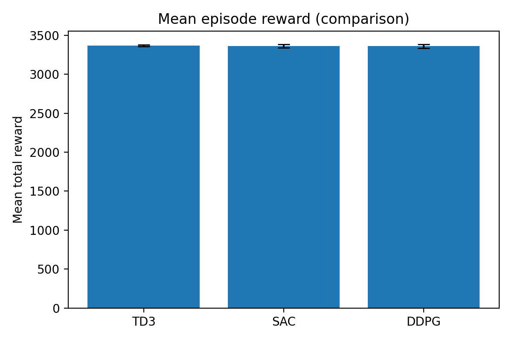
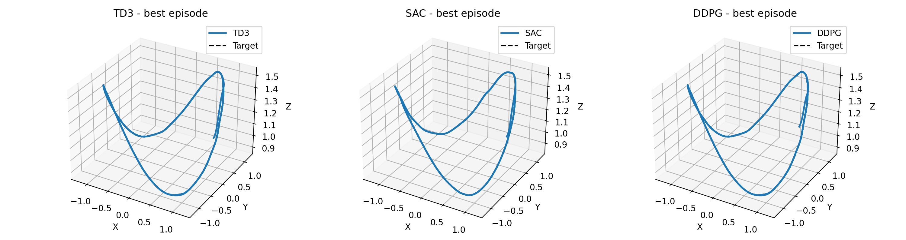
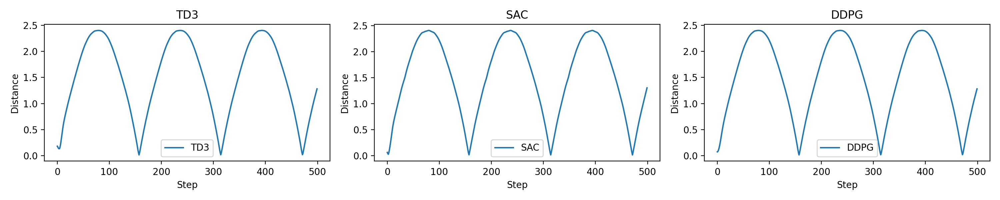
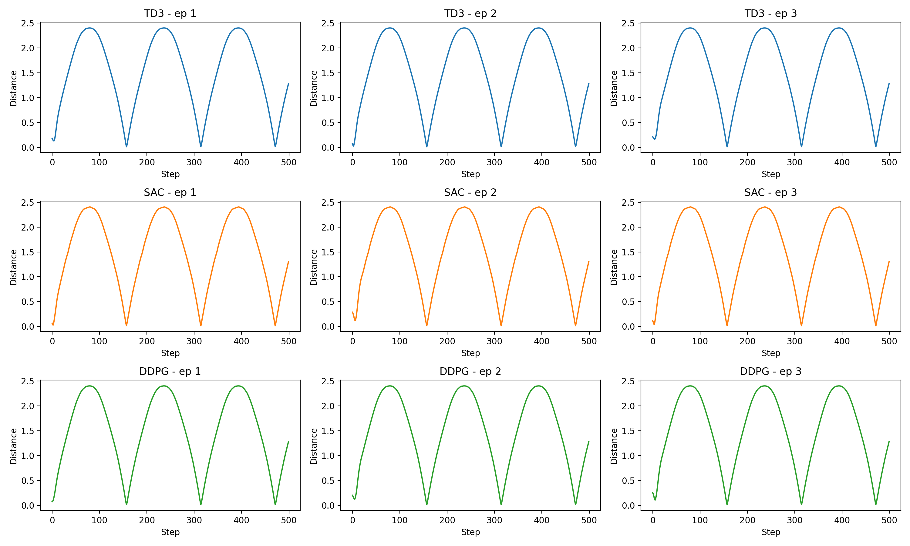
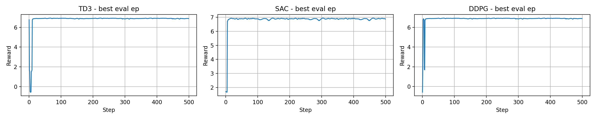
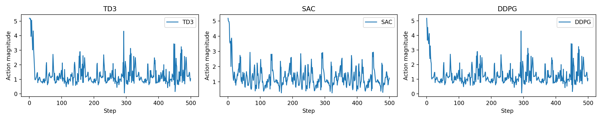
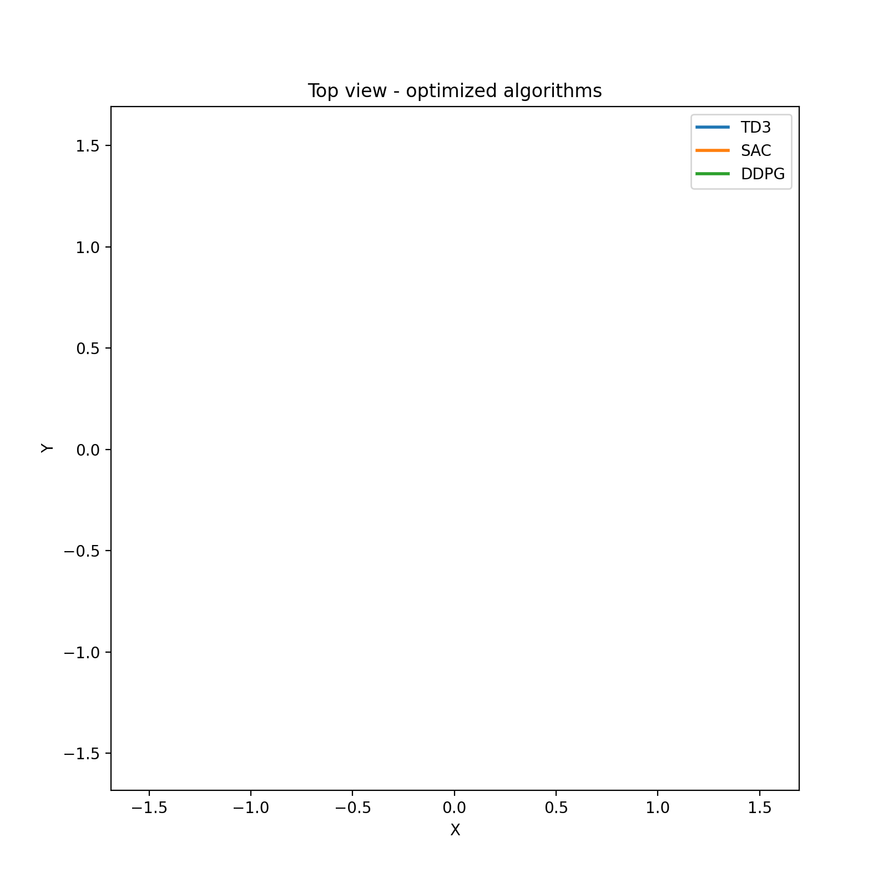

# CircleTrackRL

CircleTrackRL is a compact research codebase for training, tuning, evaluating, and visualizing continuous-control reinforcement learning agents on a 3D circular trajectory tracking task. The environment is quadrotor-like: an agent controls 3D acceleration and learns to follow a moving circular reference path while staying inside a safe operating region.

Co-authors: Hayk Nalchajyan, Liana Zhamkochyan

## Overview

This project compares optimized TD3, SAC, and DDPG-style controllers on the same circular tracking benchmark. It includes the full workflow needed for repeatable experiments:

- A lightweight Gymnasium-compatible 3D tracking environment.
- Optuna-based hyperparameter tuning for continuous-control agents.
- Final model training with the best discovered parameters.
- Evaluation summaries saved as CSV files.
- Static result plots and animated trajectory comparisons.

## Problem Statement

The goal is to control a point-mass, quadrotor-like system so that its 3D position tracks a time-varying circular reference:

- The target moves around a horizontal circle.
- The altitude also changes sinusoidally.
- The agent receives position, velocity, target position, tracking error, and phase information.
- The action is a continuous 3D acceleration vector.
- The reward encourages low tracking error, smooth motion, low action magnitude, and safety.

This makes the task useful for testing continuous-control algorithms on a small but meaningful trajectory-following problem.

## Environment

The custom environment is implemented in [envs/circle_tracking_env.py](envs/circle_tracking_env.py).

| Component | Description |
| --- | --- |
| Environment | `CircleTracking3DEnv` |
| Observation size | 14 |
| Action size | 3 |
| Action range | `[-3, 3]` for each axis |
| Episode length | 500 steps by default |
| Time step | `0.05` |
| Target path | 3D circular trajectory with sinusoidal altitude |
| Safety bounds | `x, y` in `[-2, 2]`, `z` in `[0.1, 2.5]` |

## Algorithms

The experiments compare:

- `TD3`: Twin Delayed Deep Deterministic Policy Gradient.
- `SAC`: Soft Actor-Critic.
- `DDPG`: Implemented as a TD3 configuration because Stable-Baselines3 does not provide a native DDPG class.

Best hyperparameters are stored in [tuning_results](tuning_results).

## Repository Structure

```text
CircleTrackRL/
|-- envs/
|   `-- circle_tracking_env.py
|-- training/
|   `-- train_best_circle_model.py
|-- tuning/
|   `-- tune_circle_optuna.py
|-- tuning_results/
|   |-- best_ddpg_params.json
|   |-- best_sac_params.json
|   `-- best_td3_params.json
|-- visualization/
|   |-- animate_optimized_comparison.py
|   `-- plot_optimized_results.py
|-- results/
|   |-- animations/
|   |-- plots/
|   |-- optimized_model_evaluation_summary.csv
|   `-- summary.csv
|-- requirements.txt
|-- run_pipeline.sh
`-- README.md
```

## Installation

Create a virtual environment and install the project dependencies:

```bash
python -m venv .venv
source .venv/bin/activate
pip install -r requirements.txt
```

Main dependencies:

- `gymnasium`
- `stable-baselines3`
- `torch`
- `optuna`
- `numpy`
- `pandas`
- `matplotlib`
- `tensorboard`

## Quick Start

Run the full experiment pipeline:

```bash
./run_pipeline.sh
```

The pipeline performs:

1. Bayesian hyperparameter optimization for TD3, SAC, and DDPG.
2. Final training using the best parameters.
3. Evaluation of trained models.
4. Plot and animation generation.

## Running Individual Steps

Tune one algorithm:

```bash
python -m tuning.tune_circle_optuna --algo TD3 --trials 10 --timesteps 20000 --eval-episodes 3
```

Train a final optimized model:

```bash
python -m training.train_best_circle_model --algo TD3 --timesteps 300000
```

Generate result plots:

```bash
python visualization/plot_optimized_results.py
```

Generate trajectory animations:

```bash
python visualization/animate_optimized_comparison.py
```

## Results

The optimized evaluation summary is saved in [results/optimized_model_evaluation_summary.csv](results/optimized_model_evaluation_summary.csv).

| Algorithm | Mean reward | Reward std | Mean tracking error | Final error | Safety rate | Episode length |
| --- | ---: | ---: | ---: | ---: | ---: | ---: |
| TD3 | 3382.70 | 35.40 | 0.01199 | 0.01242 | 1.00 | 500 |
| SAC | 3386.66 | 23.01 | 0.01521 | 0.01585 | 1.00 | 500 |
| DDPG | 3375.26 | 25.12 | 0.01209 | 0.01242 | 1.00 | 500 |

The shorter evaluation summary in [results/summary.csv](results/summary.csv) reports:

| Algorithm | Mean reward | Reward std |
| --- | ---: | ---: |
| TD3 | 3367.47 | 13.25 |
| SAC | 3362.91 | 21.93 |
| DDPG | 3360.22 | 25.48 |

Across the optimized evaluation, all algorithms completed the full 500-step episode horizon with a safety rate of `1.0`. SAC reached the highest mean reward in the optimized summary, while TD3 and DDPG achieved slightly lower mean tracking error.

## Result Plots

### Reward Comparison



### 3D Trajectories



### Distance to Target





### Reward Over Time



### Action Magnitude



## Animations

### 3D Tracking Animation


### Top-View Tracking Animation



## Output Files

After running the pipeline, the main outputs are:

- `models/`: trained model checkpoints.
- `tuning_results/`: Optuna trial results and best hyperparameter JSON files.
- `results/summary.csv`: compact reward comparison.
- `results/optimized_model_evaluation_summary.csv`: detailed optimized evaluation metrics.
- `results/plots/`: static evaluation figures.
- `results/animations/`: GIF trajectory visualizations.

## Reproducibility Notes

- The provided pipeline uses fixed experiment budgets in [run_pipeline.sh](run_pipeline.sh).
- Optuna searches can produce different best parameters across runs unless all random seeds and sampler settings are fixed.
- CPU thread counts are limited in [run_pipeline.sh](run_pipeline.sh) to make local runs more stable.
- For quick testing, reduce `--trials` and `--timesteps`.
- For stronger final results, increase the tuning budget and final training timesteps.

## Troubleshooting

- If imports fail, make sure the virtual environment is activated and dependencies are installed from [requirements.txt](requirements.txt).
- If model loading fails during visualization, run final training first so the expected files exist under `models/`.
- If Optuna should start from scratch, remove old trial files in `tuning_results/`.
- If GIF generation is slow, reduce the number of rollout steps or frames per second in [visualization/animate_optimized_comparison.py](visualization/animate_optimized_comparison.py).

## Future Work

- Add automated tests for environment reset, step dynamics, observation shape, and reward behavior.
- Add deterministic seed handling across tuning, training, and evaluation.
- Export per-step trajectory logs for easier external analysis.
- Extend the benchmark with figure-eight, helix, and waypoint-following trajectories.
- Add richer controllers or model-based baselines for comparison.
- Include CI checks and contribution guidelines before public release.

## Conclusion

CircleTrackRL demonstrates a complete reinforcement learning workflow for 3D trajectory tracking: environment design, hyperparameter optimization, final training, evaluation, and visual analysis. The results show that TD3, SAC, and the DDPG-style baseline can all learn stable circular tracking behavior with high safety rates and low final tracking error.

The project is intentionally small and readable, making it suitable for coursework, research prototyping, or as a starting point for more advanced autonomous-control experiments.
